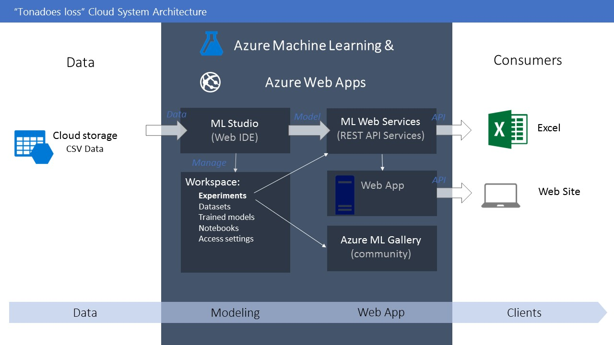
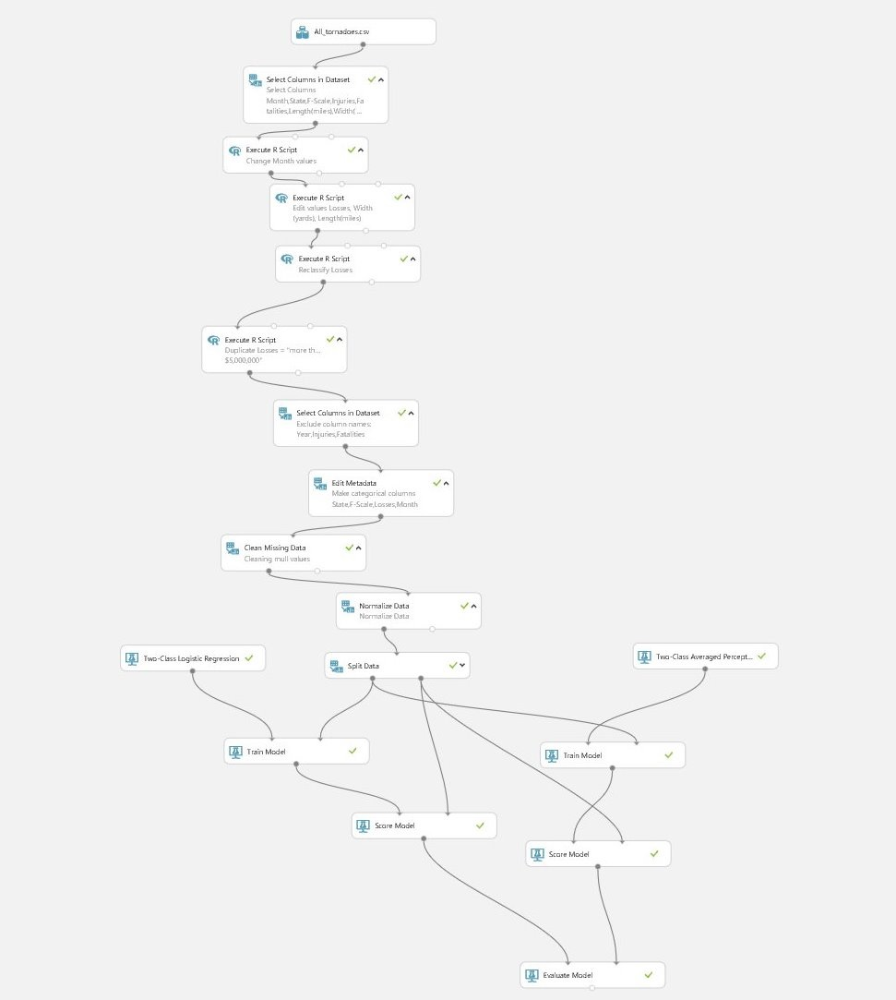
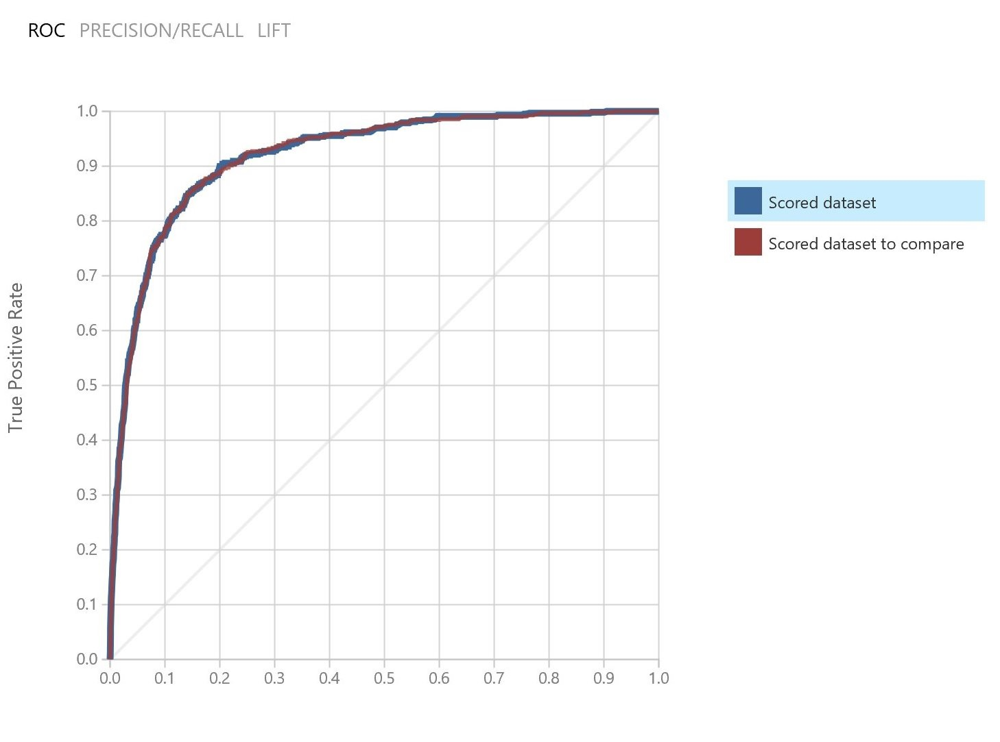
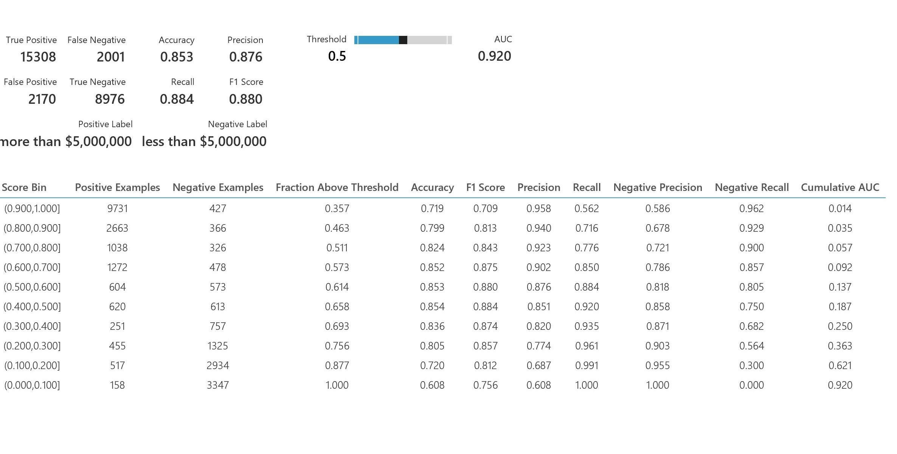
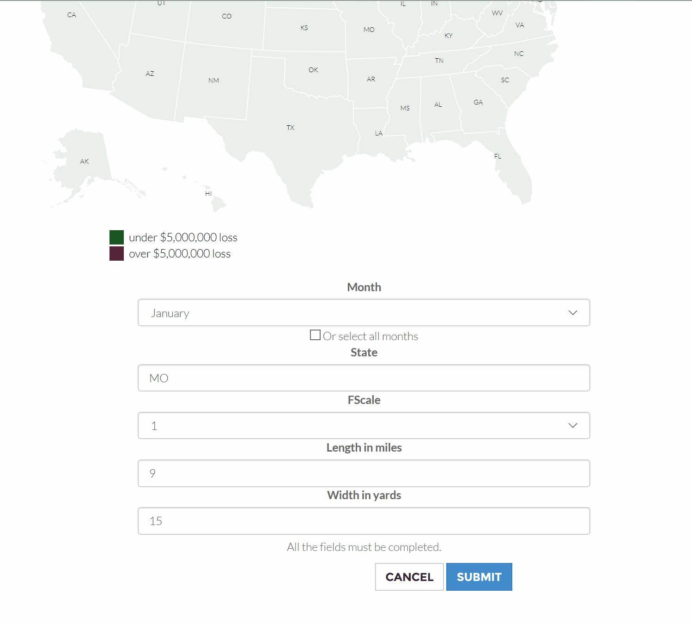
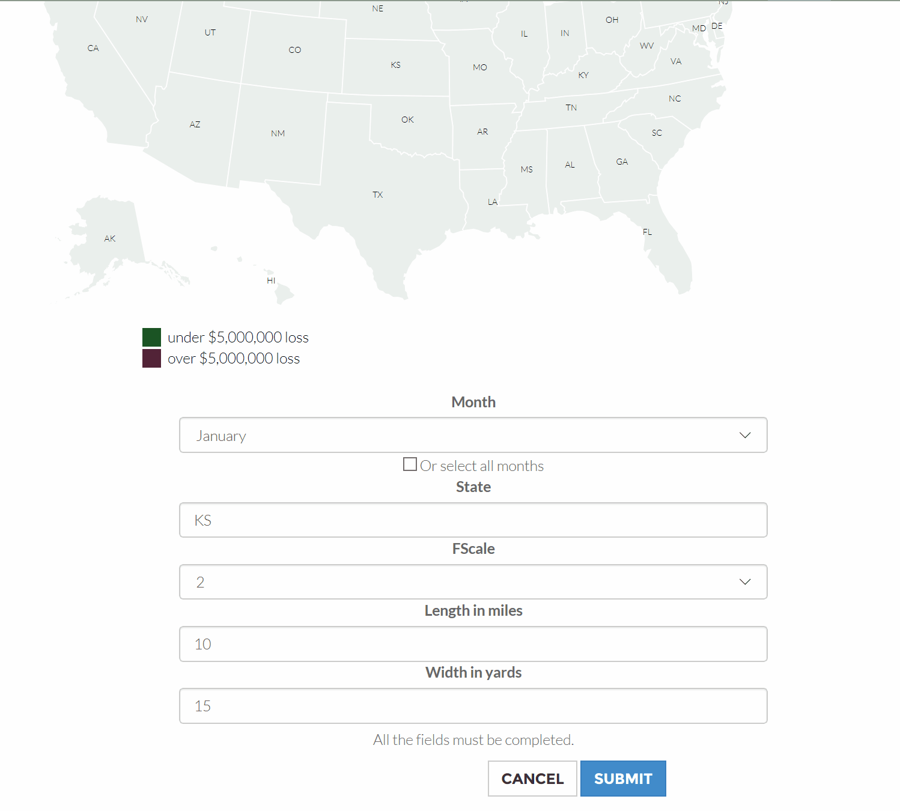

# Natural-Disasters-Loss
Natural Disasters Loss is a AI project for natural disasters cost estimation.
It uses predictive analytic services and AI for understanding and predict the cost from:
- Tornadoes (In Beta phase)
- Earthquakes (Under development)
- Floods (Under development)
- Tsunamis (Under development)
- Volcanoes (Under development)
- Wildfires (Under development)

*Web Site*

[https://naturaldisastersloss.com](https://naturaldisastersloss.com)

## Tornadoes-loss

Tornadoes-loss is a predictive service for calculating the loss in US dollars from a tornado. 

## Introduction

This is a Machine Learning experiment, which implements Predictive Analytic service in GIS projects using Azure Machine Learning.

## System Architecture

## Data

The data have being downloaded from NOAA's National Weather Service [Storm prediction center](http://www.spc.noaa.gov/wcm/#jmc) .

The csv with the data of the tornadoes from 1950-2016 can be found [here](data/All_tornadoes_with_headers.csv)

## Machine Learning

The data have being uploaded, filtered and analyzed so they would be ready for training the model.

### Azure Machine Learning

For this procedure was used the `Azure Machine Learning` platform ([link](http://studio.azureml.net/)) 

In the figure below shows the whole procedure for training and eveluating the model.

### Modeling

There have being used many Machine Learning Algorithms, but it end up in two:

1. Two-Class Logistic Regression 
2. Two-Class Averaged Perceptron 

### Evaluation 

The Roc Curve is over the random guess 

The evaluation of the two training model are shown below 

 *Notice, that the accuracy was around 85% and the precision 87%.*

## Web Service

Then it was published as a service using the Azure Machine Learning Platform and the end point returned as a Swagger API endpoint.

## GIS development

For the need of the projected it was used JS libraries like D3.js, which creates very quickly svg inteactive maps.

## Case Study

Tornado loss perdiction analysis service is a case study for predicting the cost for more or less 
than $5,000,000. 

The user can fill the parameters of the form and by submitting it, get the result of the loss than will occure.

There are two ways of querying the service:

1. By selecting one month at a time.
2. By selecting all the months and get an annual result.

For the first way, the client can discover if separately what will happen in a state.
For the second way, the client can discover that is the period that is more probably to have loss more tha $5,000,000.

Below, are shown 3 examples with their results:
1. tornado loss more than $5,000,000.
2. tornado loss less than $5,000,000.
3. tornado loss, 12 months prediction.

### Example over than $5,000,000 

 

### Example less than $5,000,000 

### Example 12 month prediction 

## License

The whole project is under the MIT License

## More reading

For more details please, check out the folder [docs](/docs)
